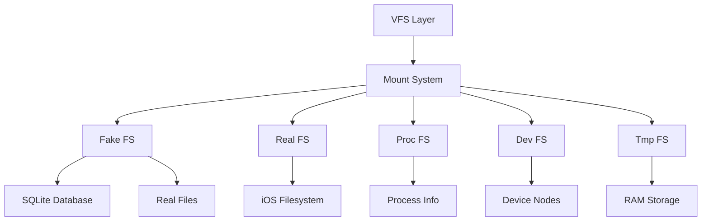

iSH implements a hybrid filesystem architecture that combines multiple backends to provide full Linux filesystem semantics on iOS.

## Filesystem Layers



## Mount System

The mount system manages different filesystem types:

```c title="fs/mount.c:9"
static const struct fs_ops *filesystems[MAX_FILESYSTEMS] = {
    &realfs,     // Real filesystem passthrough
    &procfs,     // /proc - process information
    &devptsfs,   // /dev/pts - pseudo-terminals
    &tmpfs,      // /tmp - temporary files in RAM
};

struct mount {
    const char *point;        // Mount point path (e.g., "/")
    const char *source;       // Source path or device
    const char *info;         // Mount options
    const struct fs_ops *fs;  // Filesystem operations
    void *data;              // Filesystem-specific data
    int flags;               // Mount flags (readonly, etc.)
    int refcount;            // Reference count
    int root_fd;             // File descriptor for root (real FS)
    struct list mounts;      // List of all mounts
};
```

### Finding Mounts

Mounts are stored in order of decreasing path length, so the most specific mount is found first:

```c title="fs/mount.c:26"
struct mount *mount_find(char *path) {
    lock(&mounts_lock);
    struct mount *mount = NULL;
    
    // Find the longest matching mount point
    list_for_each_entry(&mounts, mount, mounts) {
        size_t n = strlen(mount->point);
        if (strncmp(path, mount->point, n) == 0 && 
            (path[n] == '/' || path[n] == '\0'))
            break;
    }
    
    mount->refcount++;
    unlock(&mounts_lock);
    return mount;
}
```

## Fake Filesystem

The "fake" filesystem uses a **SQLite database** to store metadata (permissions, ownership, inode numbers) while storing actual file data in the real iOS filesystem.

### Why Fake FS?

<AccordionGroup>
  <Accordion title="Problem: iOS Limitations">
    iOS filesystems don't support:
    - UNIX file permissions (chmod, chown)
    - Hard links
    - Device nodes
    - Named pipes (FIFOs)
    - Arbitrary inode numbers
  </Accordion>
  
  <Accordion title="Solution: Metadata Database">
    Store metadata in SQLite:
    - Full UNIX permissions and ownership
    - Hard link reference counting
    - Device major/minor numbers
    - Custom inode numbers
    
    Store actual data in iOS files:
    - Leverage iOS storage
    - Support file sharing with iOS apps
    - Enable iOS backup/restore
  </Accordion>
</AccordionGroup>

### Database Structure

```c title="fs/fake-db.h:8"
struct fakefs_db {
    sqlite3 *db;
    struct {
        sqlite3_stmt *begin_deferred;
        sqlite3_stmt *begin_immediate;
        sqlite3_stmt *commit;
        sqlite3_stmt *rollback;
        sqlite3_stmt *path_get_inode;
        sqlite3_stmt *path_read_stat;
        sqlite3_stmt *path_create_stat;
        sqlite3_stmt *path_create_path;
        sqlite3_stmt *inode_read_stat;
        sqlite3_stmt *inode_write_stat;
        sqlite3_stmt *path_link;
        sqlite3_stmt *path_unlink;
        sqlite3_stmt *path_rename;
        sqlite3_stmt *path_from_inode;
        sqlite3_stmt *try_cleanup_inode;
    } stmt;
    sqlite3_mutex *lock;
};

struct ish_stat {
    uint32_t mode;   // File type and permissions
    uint32_t uid;    // Owner user ID
    uint32_t gid;    // Owner group ID
    uint32_t rdev;   // Device number (for device files)
};

typedef uint64_t inode_t;
```

### Key Operations

<Tabs>
  <Tab title="Path Lookup">
    ```c
    // Get inode number for a path
    inode_t path_get_inode(struct fakefs_db *fs, const char *path);
    
    // Read file metadata
    bool path_read_stat(struct fakefs_db *fs, const char *path, 
                       struct ish_stat *stat, uint64_t *inode);
    ```
  </Tab>
  
  <Tab title="File Creation">
    ```c
    // Create new file with metadata
    inode_t path_create(struct fakefs_db *fs, const char *path, 
                       struct ish_stat *stat);
    ```
  </Tab>
  
  <Tab title="Inode Operations">
    ```c
    // Read metadata by inode
    bool inode_read_stat_if_exist(struct fakefs_db *fs, 
                                 inode_t inode, struct ish_stat *stat);
    
    // Update metadata
    void inode_write_stat(struct fakefs_db *fs, inode_t inode, 
                         struct ish_stat *stat);
    ```
  </Tab>
  
  <Tab title="Hard Links">
    ```c
    // Create hard link
    void path_link(struct fakefs_db *fs, const char *src, const char *dst);
    
    // Remove hard link
    inode_t path_unlink(struct fakefs_db *fs, const char *path);
    
    // Rename (atomic)
    void path_rename(struct fakefs_db *fs, const char *src, const char *dst);
    ```
  </Tab>
</Tabs>

### Transactions

Database operations use transactions for atomicity:

```c
// Start read-only transaction
void db_begin_read(struct fakefs_db *fs);

// Start read-write transaction
void db_begin_write(struct fakefs_db *fs);

// Commit changes
void db_commit(struct fakefs_db *fs);

// Rollback on error
void db_rollback(struct fakefs_db *fs);
```

## Real Filesystem

The "real" filesystem provides direct passthrough to iOS files:

```c title="fs/real.c:62"
struct fd *realfs_open(struct mount *mount, const char *path, 
                      int flags, int mode) {
    // Translate Linux flags to iOS flags
    int real_flags = open_flags_real_from_fake(flags);
    
    // Open file on iOS filesystem
    int fd_no = openat(mount->root_fd, fix_path(path), real_flags, mode);
    if (fd_no < 0)
        return ERR_PTR(errno_map());
    
    struct fd *fd = fd_create(&realfs_fdops);
    fd->real_fd = fd_no;
    fd->dir = NULL;
    return fd;
}
```

### Flag Translation

Linux and iOS use different flag values:

```c title="fs/real.c:36"
static int open_flags_real_from_fake(int flags) {
    int real_flags = 0;
    if (flags & O_RDONLY_) real_flags |= O_RDONLY;
    if (flags & O_WRONLY_) real_flags |= O_WRONLY;
    if (flags & O_RDWR_) real_flags |= O_RDWR;
    if (flags & O_CREAT_) real_flags |= O_CREAT;
    if (flags & O_EXCL_) real_flags |= O_EXCL;
    if (flags & O_TRUNC_) real_flags |= O_TRUNC;
    if (flags & O_APPEND_) real_flags |= O_APPEND;
    if (flags & O_NONBLOCK_) real_flags |= O_NONBLOCK;
    return real_flags;
}
```

### Stat Translation

File metadata is translated between formats:

```c title="fs/real.c:87"
static void copy_stat(struct statbuf *fake_stat, struct stat *real_stat) {
    fake_stat->dev = dev_fake_from_real(real_stat->st_dev);
    fake_stat->inode = real_stat->st_ino;
    fake_stat->mode = real_stat->st_mode;
    fake_stat->nlink = real_stat->st_nlink;
    fake_stat->uid = real_stat->st_uid;
    fake_stat->gid = real_stat->st_gid;
    fake_stat->rdev = dev_fake_from_real(real_stat->st_rdev);
    fake_stat->size = real_stat->st_size;
    fake_stat->blksize = real_stat->st_blksize;
    fake_stat->blocks = real_stat->st_blocks;
    fake_stat->atime = real_stat->st_atime;
    fake_stat->mtime = real_stat->st_mtime;
    fake_stat->ctime = real_stat->st_ctime;
    // Also copy nanosecond timestamps
}
```

## File Descriptors

iSH maintains its own file descriptor table:

```c title="fs/fd.h:14"
struct fd {
    atomic_uint refcount;
    unsigned flags;           // O_CLOEXEC, etc.
    mode_t_ type;            // S_IFREG, S_IFDIR, etc.
    const struct fd_ops *ops; // Operation table
    struct list poll_fds;    // Poll waiters
    lock_t poll_lock;
    unsigned long offset;    // Current file position

    // File descriptor data
    union {
        struct { struct tty *tty; /* TTY-specific */ };
        struct { struct poll *poll; /* epoll */ };
        struct { uint64_t val; /* eventfd */ };
        struct { struct timer *timer; /* timerfd */ };
        struct { /* socket */ 
            int domain, type, protocol;
            char unix_name[108];
            struct fd *unix_peer;
            // ...
        } socket;
        void *data;  // Generic pointer
    };
    
    // Filesystem data
    union {
        struct { /* procfs */ 
            struct proc_entry entry;
            unsigned dir_index;
            struct proc_data data;
        } proc;
        struct { int num; } devpts;
        struct { /* tmpfs */
            struct tmp_dirent *dirent;
            struct tmp_dirent *dir_pos;
        } tmpfs;
        void *fs_data;
    };

    struct mount *mount;
    int real_fd;              // iOS file descriptor
    DIR *dir;                 // Directory handle
    struct inode_data *inode; // Inode cache
    
    lock_t lock;
    cond_t cond;
};
```

### FD Operations

```c title="fs/fd.h:131"
struct fd_ops {
    ssize_t (*read)(struct fd *fd, void *buf, size_t bufsize);
    ssize_t (*write)(struct fd *fd, const void *buf, size_t bufsize);
    ssize_t (*pread)(struct fd *fd, void *buf, size_t bufsize, off_t off);
    ssize_t (*pwrite)(struct fd *fd, const void *buf, size_t bufsize, off_t off);
    off_t_ (*lseek)(struct fd *fd, off_t_ off, int whence);

    int (*readdir)(struct fd *fd, struct dir_entry *entry);
    unsigned long (*telldir)(struct fd *fd);
    void (*seekdir)(struct fd *fd, unsigned long ptr);

    int (*mmap)(struct fd *fd, struct mem *mem, page_t start, 
               pages_t pages, off_t offset, int prot, int flags);
    int (*poll)(struct fd *fd);
    ssize_t (*ioctl_size)(int cmd);
    int (*ioctl)(struct fd *fd, int cmd, void *arg);
    int (*fsync)(struct fd *fd);
    int (*close)(struct fd *fd);
    int (*getflags)(struct fd *fd);
    int (*setflags)(struct fd *fd, dword_t arg);
};
```

### FD Table

```c title="fs/fd.h:171"
struct fdtable {
    atomic_uint refcount;
    unsigned size;
    struct fd **files;        // Array of file descriptors
    bits_t *cloexec;         // Close-on-exec flags
    lock_t lock;
};

// Get FD from current process
struct fd *f_get(fd_t f);

// Install new FD, returns FD number
fd_t f_install(struct fd *fd, int flags);

// Close FD
int f_close(fd_t f);
```

## Special Filesystems

### /proc - Process Information

```c title="fs/proc.c:8"
static int proc_lookup(const char *path, struct proc_entry *entry) {
    entry->meta = &proc_root;
    char component[MAX_NAME + 1];
    int err = 0;
    
    // Walk path components
    while (path_next_component(&path, component, &err)) {
        if (!S_ISDIR(proc_entry_mode(entry))) {
            err = _ENOTDIR;
            break;
        }
        
        // Look up next component in directory
        // ...
    }
    return err;
}
```

Exposed information:
- `/proc/self` → current process
- `/proc/[pid]/` → process-specific info
- `/proc/[pid]/stat` → process statistics
- `/proc/[pid]/maps` → memory mappings
- `/proc/[pid]/fd/` → open file descriptors

### /dev - Device Nodes

```c title="fs/dev.c:9"
struct dev_ops *block_devs[256] = {
    // No block devices yet
};

struct dev_ops *char_devs[256] = {
    [MEM_MAJOR] = &mem_dev,              // /dev/null, /dev/zero, etc.
    [TTY_CONSOLE_MAJOR] = &tty_dev,      // /dev/console
    [TTY_ALTERNATE_MAJOR] = &tty_dev,    // /dev/tty
    [TTY_PSEUDO_MASTER_MAJOR] = &tty_dev, // /dev/ptmx
    [TTY_PSEUDO_SLAVE_MAJOR] = &tty_dev,  // /dev/pts/*
    [DYN_DEV_MAJOR] = &dyn_dev_char,     // Dynamic devices
};

int dev_open(int major, int minor, int type, struct fd *fd) {
    struct dev_ops *dev = (type == DEV_BLOCK ? block_devs : char_devs)[major];
    if (dev == NULL)
        return _ENXIO;
    
    fd->ops = &dev->fd;
    if (!dev->open)
        return 0;
    
    return dev->open(major, minor, fd);
}
```

### /tmp - Temporary Files

Implemented entirely in RAM - files are lost on app restart.

## TTY/PTY Support

Terminal and pseudo-terminal support:

```c title="fs/tty.c:21"
struct tty *tty_alloc(struct tty_driver *driver, int type, int num) {
    struct tty *tty = malloc(sizeof(struct tty));
    
    tty->refcount = 0;
    tty->driver = driver;
    tty->type = type;
    tty->num = num;
    tty->hung_up = false;
    tty->session = 0;
    tty->fg_group = 0;
    
    // Terminal settings
    tty->termios.iflags = ICRNL_ | IXON_;
    tty->termios.oflags = OPOST_ | ONLCR_;
    tty->termios.lflags = ISIG_ | ICANON_ | ECHO_ | ECHOE_ | ECHOK_;
    
    // Initialize buffer
    tty->bufsize = 0;
    lock_init(&tty->lock);
    cond_init(&tty->produced);
    cond_init(&tty->consumed);
    
    return tty;
}
```

TTY drivers:
- Console TTY (stdin/stdout/stderr)
- PTY master/slave pairs (for ssh, tmux, etc.)

## Filesystem Operations

<Tabs>
  <Tab title="Open">
    ```c
    fd_t sys_open(addr_t path_addr, dword_t flags, mode_t_ mode) {
        // Read path from user memory
        char path[MAX_PATH];
        if (user_read_string(path_addr, path, sizeof(path)))
            return _EFAULT;
        
        // Find mount point
        struct mount *mount = mount_find(path);
        
        // Call filesystem-specific open
        struct fd *fd = mount->fs->open(mount, path, flags, mode);
        if (IS_ERR(fd))
            return PTR_ERR(fd);
        
        // Install in FD table
        return f_install(fd, flags);
    }
    ```
  </Tab>
  
  <Tab title="Read/Write">
    ```c
    dword_t sys_read(fd_t fd_no, addr_t buf_addr, dword_t size) {
        struct fd *fd = f_get(fd_no);
        if (fd == NULL)
            return _EBADF;
        
        // Allocate kernel buffer
        char *buf = malloc(size);
        
        // Read via FD ops
        ssize_t res = fd->ops->read(fd, buf, size);
        
        // Copy to user memory
        if (res > 0)
            user_write(buf_addr, buf, res);
        
        free(buf);
        return res;
    }
    ```
  </Tab>
  
  <Tab title="Stat">
    ```c
    dword_t sys_stat64(addr_t path_addr, addr_t statbuf_addr) {
        char path[MAX_PATH];
        if (user_read_string(path_addr, path, sizeof(path)))
            return _EFAULT;
        
        struct mount *mount = mount_find(path);
        struct statbuf stat;
        
        int err = mount->fs->stat(mount, path, &stat);
        if (err < 0)
            return err;
        
        // Copy stat to user memory
        if (user_put(statbuf_addr, stat))
            return _EFAULT;
        
        return 0;
    }
    ```
  </Tab>
</Tabs>

## Performance Considerations

<AccordionGroup>
  <Accordion title="Database Overhead">
    SQLite operations add overhead to metadata-heavy operations (stat, readdir). The database uses prepared statements and transactions to minimize overhead.
  </Accordion>
  
  <Accordion title="Memory Copies">
    Data must be copied between user memory and kernel buffers, then to/from iOS files. This is slower than native file I/O.
  </Accordion>
  
  <Accordion title="Mount Lookup">
    Each path operation requires a mount lookup. Mounts are sorted by length to optimize this.
  </Accordion>
  
  <Accordion title="Inode Caching">
    Frequently accessed inodes are cached to avoid repeated database queries.
  </Accordion>
</AccordionGroup>

## Related Topics

<CardGroup cols={2}>
  <Card title="Syscalls" icon="exchange" href="/architecture/syscalls">
    How filesystem operations are invoked
  </Card>
  
  <Card title="Emulation" icon="microchip" href="/architecture/emulation">
    Memory management for file I/O
  </Card>
</CardGroup>