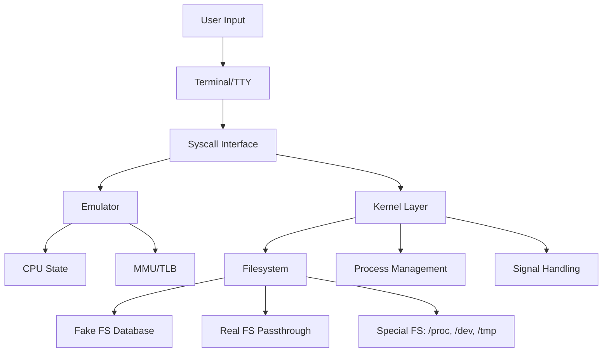

iSH is a Linux shell environment for iOS that uses usermode x86/x86_64 emulation and syscall translation to run a full Alpine Linux distribution on iOS devices. This page provides a high-level overview of the system architecture.

## Core Components

iSH consists of four major subsystems that work together to provide a Linux environment:

<CardGroup cols={2}>
  <Card title="Emulator" icon="microchip" href="/architecture/emulation">
    x86/x86_64 CPU instruction emulation using a threaded code interpreter
  </Card>
  
  <Card title="Kernel" icon="gears" href="/architecture/syscalls">
    Linux syscall implementation and translation to iOS/Darwin APIs
  </Card>
  
  <Card title="Filesystem" icon="folder-tree" href="/architecture/filesystem">
    Virtual filesystem layer with fake database and real file passthrough
  </Card>
  
  <Card title="Terminal" icon="terminal">
    TTY/PTY subsystem for terminal emulation and I/O
  </Card>
</CardGroup>

## System Architecture Diagram



## Data Flow

Here's how a typical operation flows through the system:

<Steps>
  <Step title="User Input">
    User enters a command in the terminal (e.g., `ls /tmp`)
  </Step>
  
  <Step title="Emulation">
    The x86 emulator executes the program's instructions, maintaining CPU state (registers, flags, etc.)
  </Step>
  
  <Step title="Syscall Trap">
    When the program makes a Linux syscall (e.g., `getdents64`), it triggers an interrupt:
    - x86: `int 0x80` (INT_SYSCALL)
    - x86_64: `syscall` instruction (INT_SYSCALL64)
  </Step>
  
  <Step title="Syscall Translation">
    The kernel layer translates the Linux syscall to iOS/Darwin equivalents or emulates it directly
  </Step>
  
  <Step title="Filesystem Access">
    The filesystem layer handles the request using the appropriate backend (fake DB, real FS, or special FS)
  </Step>
  
  <Step title="Result Return">
    Results are written back to emulated memory and returned through CPU registers
  </Step>
</Steps>

## Component Interaction

### Emulator ↔ Kernel

The emulator and kernel communicate through the interrupt handling mechanism:

```c title="kernel/calls.c:490"
void handle_interrupt(int interrupt) {
  struct cpu_state *cpu = &current->cpu;
  if (interrupt == INT_SYSCALL64) {
    unsigned syscall_num = cpu->rax;
    // x86_64 argument order: rdi, rsi, rdx, r10, r8, r9
    int64_t result = syscall_table[syscall_num](cpu->rdi, cpu->rsi, cpu->rdx,
                                                cpu->r10, cpu->r8, cpu->r9);
    cpu->rax = result;
  }
  // ... handle other interrupts
}
```

### Kernel ↔ Filesystem

The kernel accesses files through the mount system and filesystem operations:

```c
// Find the appropriate mount point for a path
struct mount *mount = mount_find(path);
// Use filesystem-specific operations
struct fd *fd = mount->fs->open(mount, path, flags, mode);
```

### Memory Management

The MMU (Memory Management Unit) and TLB (Translation Lookaside Buffer) provide fast memory access:

- **MMU**: Translates guest virtual addresses to host memory pointers
- **TLB**: Caches recent translations to avoid repeated lookups
- **Page Faults**: Handled through the `INT_GPF` interrupt when accessing unmapped memory

## Key Design Decisions

<AccordionGroup>
  <Accordion title="Threaded Code Interpreter">
    Instead of a traditional switch-based interpreter or JIT compilation, iSH uses a threaded code technique where each instruction is compiled to a sequence of function pointers (gadgets). Each gadget ends with a tail call to the next, providing 3-5x speedup over switch dispatch.
    
    See [Emulation Details](/architecture/emulation) for more information.
  </Accordion>
  
  <Accordion title="Hybrid Filesystem">
    iSH uses both a SQLite database (for metadata like permissions) and real filesystem passthrough (for actual data). This allows:
    - Proper UNIX permissions on iOS
    - Integration with iOS Documents and file sharing
    - Special filesystems like /proc and /dev
    
    See [Filesystem Architecture](/architecture/filesystem) for details.
  </Accordion>
  
  <Accordion title="Syscall Translation">
    Rather than emulating the entire Linux kernel, iSH translates Linux syscalls to their iOS/Darwin equivalents where possible, and emulates them when necessary. This provides better performance and integration with the host OS.
    
    See [Syscall Handling](/architecture/syscalls) for implementation details.
  </Accordion>
</AccordionGroup>

## Source Code Structure

<CodeGroup>
```bash emu/
# CPU emulation, gadgets, MMU, TLB
emu/
├── cpu.h          # CPU state structure
├── mmu.h          # Memory management unit
├── tlb.c          # Translation lookaside buffer
├── fpu.c          # FPU emulation
├── vec.c          # SSE/vector instructions
└── mmx.c          # MMX instructions
```

```bash kernel/
# Syscall implementation
kernel/
├── calls.h        # Syscall declarations
├── calls.c        # Syscall dispatch table
├── errno.c        # Error code mapping
├── task.h         # Process/task structures
└── signal.h       # Signal handling
```

```bash fs/
# Filesystem implementation
fs/
├── fake-db.c      # SQLite-based metadata storage
├── real.c         # Real filesystem passthrough
├── mount.c        # Mount system
├── fd.c           # File descriptor management
├── proc.c         # /proc filesystem
├── dev.c          # /dev filesystem
└── tty.c          # TTY/PTY support
```

```bash asbestos/
# Gadget system (assembly)
asbestos/
└── gadgets-*.h    # Architecture-specific gadgets
```
</CodeGroup>

<Note>
  The name "asbestos" for the gadget system is a reference to the inherent danger of working with low-level assembly code and compiler/linker quirks. As noted in the README: "Long-term exposure to this code may cause loss of sanity."
</Note>

## Performance Considerations

- **TLB Caching**: Frequently accessed memory pages are cached in the TLB to avoid MMU translation overhead
- **Gadget Arrays**: Pre-compiled instruction sequences avoid interpretation overhead
- **Direct Syscall Translation**: When possible, Linux syscalls map directly to iOS APIs without emulation
- **Lazy Evaluation**: Many operations are deferred until actually needed (e.g., directory handles)

## Next Steps

<CardGroup cols={3}>
  <Card title="Emulation" icon="microchip" href="/architecture/emulation">
    Deep dive into CPU emulation and the gadget system
  </Card>
  
  <Card title="Syscalls" icon="exchange" href="/architecture/syscalls">
    Learn how Linux syscalls are translated to iOS
  </Card>
  
  <Card title="Filesystem" icon="database" href="/architecture/filesystem">
    Explore the hybrid filesystem architecture
  </Card>
</CardGroup>